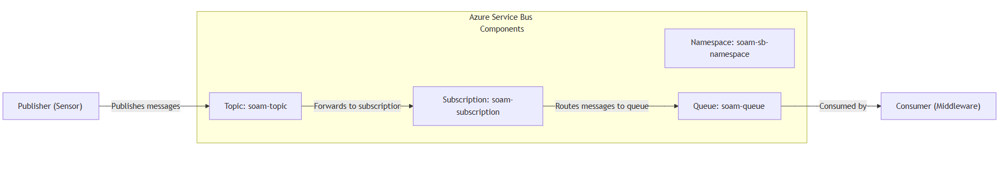
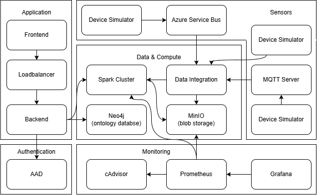

# Message Passing Performance Project: Technical Report 2

## Table of Contents

- [Message Passing Performance Project: Technical Report 2](#message-passing-performance-project-technical-report-2)
  - [Table of Contents](#table-of-contents)
  - [1. System Architecture](#1-system-architecture)
  - [2. Implementation Details](#2-implementation-details)
  - [3. Functionality Verification and Testing](#3-functionality-verification-and-testing)
  - [4. Progress Assessment](#4-progress-assessment)

---

## 1. System Architecture

In context of the **Message Passing Performance** project, the architecture is simplified to allow for easy understanding and implementation. The architecture consists of the following components:
1. **Azure Service Bus Namespace** – The message broker.
2. **Service Bus Topic** – Handles published messages.
3. **Service Bus Queue** – Messages are forwarded here.
4. **Python Application** – Sends & receives messages.
5. **Terraform** – Infrastructure as code tool for deployment.

The entry point of the system is the **Sensor** (Python application) that sends messages to the **Service Bus Topic**. The **Service Bus Topic** is configured to forward messages to a **Subscription**. The **Subscription** is configured to route messages to a **Service Bus Queue**. Once queued, the **Receiver** (Python application) can read messages from the **Service Bus Queue**.

This design allows for a decoupled architecture where the **Sender** and **Receiver** can operate independently. The **Service Bus Topic** acts as a message broker, allowing multiple subscribers to receive messages without being directly connected to the sender.

Following is the architecture diagram for the simple message passing system:

For a more real world scenario, I propose a more complex architecture that covers all the components required for a middlewarre system for integration of mutliple data sources. The architecture consists of the following components:

## 2. Implementation Details

TODO

## 3. Functionality Verification and Testing

TODO

## 4. Progress Assessment

TODO