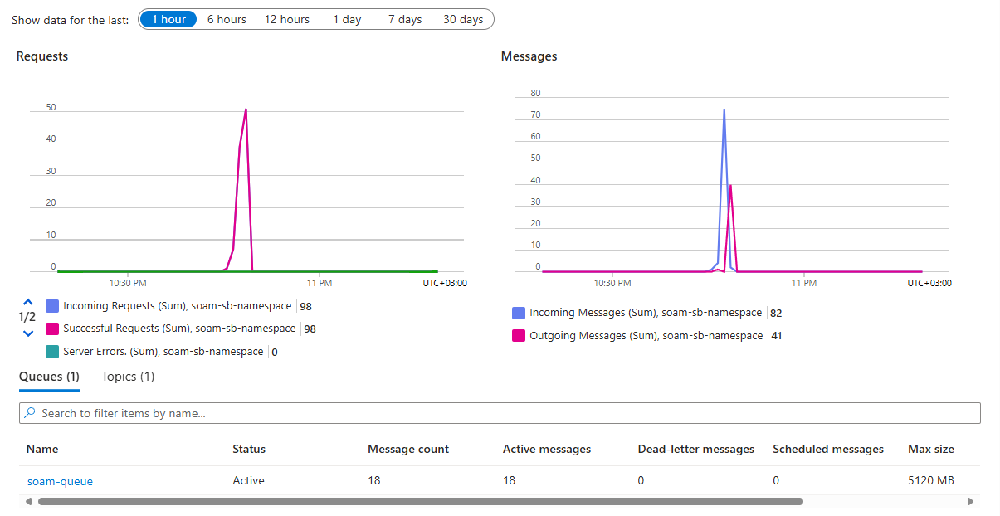

# Message Passing Performance Project: Technical Report 3

## Table of Contents

- [Message Passing Performance Project: Technical Report 2](#message-passing-performance-project-technical-report-2)
  - [Table of Contents](#table-of-contents)
  - [1. System Architecture](#1-system-architecture)
  - [2. Implementation Details](#2-implementation-details)
  - [3. Functionality Verification and Testing](#3-functionality-verification-and-testing)
  - [4. Progress Assessment](#4-progress-assessment)

---

## 1. System Architecture

In context of the **Message Passing Performance** project, the architecture is simplified to allow for easy understanding and implementation. The architecture consists of the following components:
1. **Azure Service Bus Namespace** – The message broker.
2. **Service Bus Topic** – Handles published messages.
3. **Service Bus Queue** – Messages are forwarded here.
4. **Python Application** – Sends & receives messages.
5. **Terraform** – Infrastructure as code tool for deployment.

The entry point of the system is the **Sensor** (Python application) that sends messages to the **Service Bus Topic**. The **Service Bus Topic** is configured to forward messages to a **Subscription**. The **Subscription** is configured to route messages to a **Service Bus Queue**. Once queued, the **Receiver** (Python application) can read messages from the **Service Bus Queue**.

This design allows for a decoupled architecture where the **Sender** and **Receiver** can operate independently. The **Service Bus Topic** acts as a message broker, allowing multiple subscribers to receive messages without being directly connected to the sender.

Following is the architecture diagram for the simple message passing system:


For a more real world scenario, I propose a more complex architecture that covers all the components required for a middlewarre system for integration of mutliple data sources. The architecture consists of the following components:


## 2. Implementation Details

Considering that `Azure Service Bus` is a fully managed service, the implementation of the system can be described using the following Terraform code:

```python
# Create a Service Bus Namespace
resource "azurerm_servicebus_namespace" "soam" {
  name                = "soam-sb-namespace"
  location            = azurerm_resource_group.soam.location
  resource_group_name = azurerm_resource_group.soam.name
  sku                 = "Standard"
}

# Create a Service Bus Topic
resource "azurerm_servicebus_topic" "soam_topic" {
  name         = "soam-topic"
  namespace_id = azurerm_servicebus_namespace.soam.id

  # Enable partitioning for better scalability
  partitioning_enabled = true
}

# Create a Service Bus Queue to which messages will be forwarded
resource "azurerm_servicebus_queue" "soam_queue" {
  name                = "soam-queue"
  namespace_id = azurerm_servicebus_namespace.soam.id
}

# Create a Service Bus Subscription that forwards messages to the queue
resource "azurerm_servicebus_subscription" "soam_subscription" {
  name     = "soam-subscription"
  topic_id = azurerm_servicebus_topic.soam_topic.id

  # Configure the maximum delivery attempts before sending the message to the dead-letter queue
  max_delivery_count = 10

  # Forward incoming messages to the queue
  forward_to = azurerm_servicebus_queue.soam_queue.name
}
```

The key configurations in the above code are:
- **Namespace + Topic + Subscription + Queue**: This creates the core components of the message passing system.
- **Forwarding**: The subscription is configured to forward messages to the queue, allowing the receiver to read messages from the queue.
- **Partitioning**: The topic is configured to enable partitioning, which allows for better scalability and performance.
- **Max Delivery Count**: The maximum delivery attempts before sending the message to the dead-letter queue is set to 10. This ensures that messages that cannot be delivered are not lost and can be retried later.

For the performance evaluation of the system, I will be using the following metrics:
- **Latency**: The time taken to send a message from the sender to the receiver. This metric will help in understanding the responsiveness of the system.
- **Throughput**: The number of messages sent and received per second. This metric will help in understanding the scalability of the system.
- **Resource Utilization**: The CPU and memory usage of the sender and receiver during the message passing process. This metric will help in understanding the resource efficiency of the system.
- **Error Rate**: The number of messages that failed to be sent or received. This metric will help in understanding the reliability of the system.

## 3. Functionality Verification and Testing

At this stage of the project I have confirmed that the system is working correctly.

```ps1
@vtiftilov [D:\personal\message-passing-perf\app] git(main)
➜  python src/app.py send "test message"
@vtiftilov [D:\personal\message-passing-perf\app] git(main)
➜  python src/app.py receive
Received: test message
@vtiftilov [D:\personal\message-passing-perf\app] git(main)
➜  
```

As another proof of the functionality, I have used the built-in monitoring dashboard of the `Azure Service Bus` to check the number of messages in the queue and the number of messages sent and received. 



The next step was to check the performance of the system. I have used the following command to test the performance of the system:

```ps1
➜  python src/app.py perf 2 20  test
Clearing queue before starting performance testing...
Sent 40 messages in 64.43 seconds.
Measuring read performance: reading messages from the queue...
Read 40 messages in 5.98 seconds
```

The results of the performance test showed that the system throughput is 6 messages per second. This is way below the expected throughput of 2000 messages per second as per the documentation of the `Azure Service Bus`. The reason for this is that the system is not optimized for performance yet. The next step is to optimize the performance of the system by using message batching and other techniques.

## 4. Progress Assessment

The project is currently implemented (**50%**) and working, but not optimized for performance. What is left to do is to optimize the performance of the system by using message batching and other techniques. The following tasks are remaining:
- **Optimize Performance**: Measure latency and throughput.
- **Add Message Batching**: Improve efficiency with bulk processing.
- **Add Error Handling**: Implement retry logic and dead-letter queue processing.