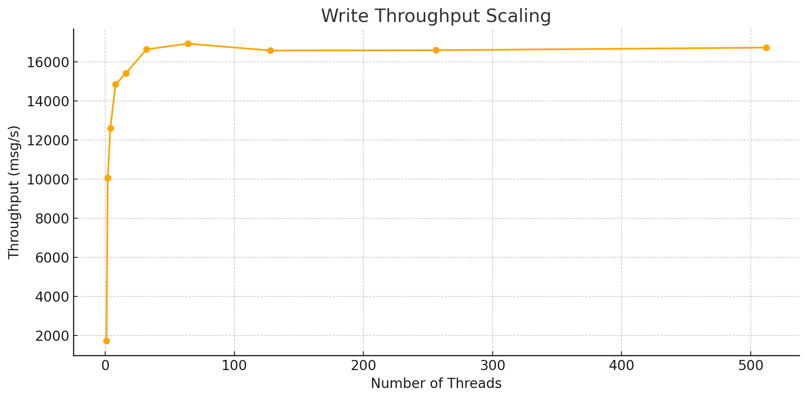
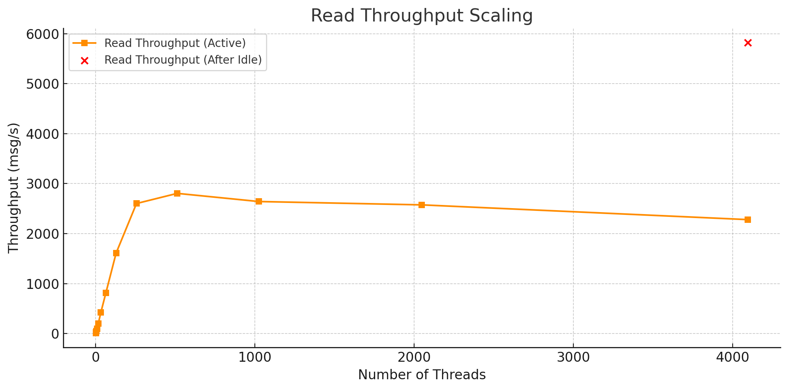
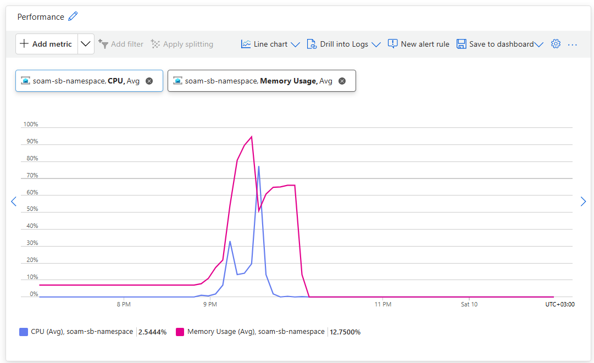
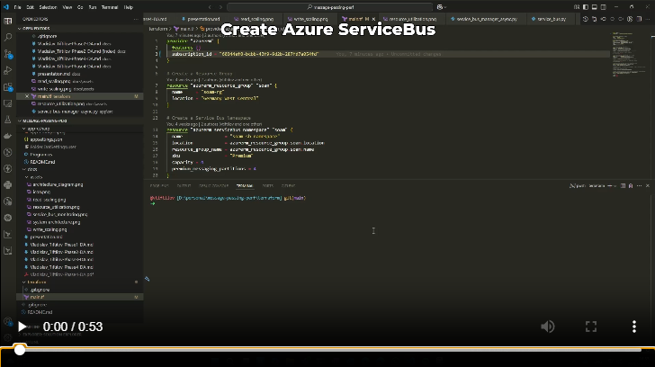

## **Message Passing Performance Project**

##### Author: Vladislav Tiftilov

---

# Overview

* **Objective:** Evaluate and optimize message-passing performance using Azure Service Bus.
* **Context:** Integration into Smart City middleware platform.
* **Goal:** High-throughput, low-latency communication between sensors and middleware components.

---

# Technical Specifications

| Component              | Technology        | Reasoning              |
| ---------------------- | ----------------- | ---------------------- |
| Cloud Provider         | Azure             | Managed services       |
| Messaging Service      | Azure Service Bus | Async messaging        |
| Infrastructure as Code | Terraform         | Automation             |
| Programming Language   | Python → C#       | Scripting, performance |

---

# Why Azure Service Bus?

* Optimized for event-driven messaging
* Supports asynchronous processing
* Good integration with Azure ecosystem
* Provides enterprise-grade durability

---

# Architecture

<style>
img[alt~="center-architecture"] {
    display: block;
    margin: 150px auto;
    width: 100%;
    border: 1px solid gray;
    padding: 5px;
    background-color:rgb(255, 255, 255);
}
</style>


---

# Implementation

### Infrastructure Setup (Terraform)

```sh
cd terraform
terraform init
terraform apply
```


```python
# Create a Service Bus Namespace
resource "azurerm_servicebus_namespace" "soam" {
  name                = "soam-sb-namespace"
  location            = azurerm_resource_group.soam.location
  resource_group_name = azurerm_resource_group.soam.name
  sku                 = "Standard"
}
```

---

```python
# Create a Service Bus Topic
resource "azurerm_servicebus_topic" "soam_topic" {
  name         = "soam-topic"
  namespace_id = azurerm_servicebus_namespace.soam.id

  # Enable partitioning for better scalability
  partitioning_enabled = true
}

# Create a Service Bus Queue to which messages will be forwarded
resource "azurerm_servicebus_queue" "soam_queue" {
  name                = "soam-queue"
  namespace_id = azurerm_servicebus_namespace.soam.id
}

# Create a Service Bus Subscription that forwards messages to the queue
resource "azurerm_servicebus_subscription" "soam_subscription" {
  name     = "soam-subscription"
  topic_id = azurerm_servicebus_topic.soam_topic.id

  # Configure the maximum delivery attempts before sending the message to the dead-letter queue
  max_delivery_count = 10

  # Forward incoming messages to the queue
  forward_to = azurerm_servicebus_queue.soam_queue.name
}
```
---

# Initial Results

| Action | Messages | Time (s) | Throughput (msg/s) |
| ------ | -------- | -------- | ------------------ |
| Sent   | 40       | 81.38    | 0.49               |
| Read   | 40       | 5.92     | 6.76               |

**Conclusion:** Functional, but initial low performance.

---

# Existing Solutions Comparison

| System   | Strengths                         | Weaknesses                   |
| -------- | --------------------------------- | ---------------------------- |
| Kafka    | High throughput, scalable         | Complex, resource-intensive  |
| RabbitMQ | Flexible, mature protocol         | Performance under heavy load |
| SNS/SQS  | Managed, scalable, fault-tolerant | Vendor lock-in               |
| MQTT     | Lightweight, ideal for IoT        | Limited throughput           |
| Azure SB | Durable, Azure integrated         | Configuration overhead       |

---

# Implementation Updates

* **Migrated Python → C#** for better performance
* Upgraded Azure Service Bus to **Premium tier**
* Batched messages for sending 

**Key Configurations:**

* **PrefetchCount:** Reduces latency
* **MaxConcurrentCalls:** Allows parallel message processing

---

```csharp
var sender = client.CreateSender(queueName);
var batch = new List<ServiceBusMessage>();
for (int i = 0; i < messagesPerThread; i++)
{
    var message = new ServiceBusMessage($"Message {i}");
    batch.Add(message);
}
await sender.SendMessagesAsync(batch); // Send messages in batch
```

```csharp
var processorOptions = new ServiceBusProcessorOptions
{
    ReceiveMode = ServiceBusReceiveMode.PeekLock,
    MaxConcurrentCalls = 4096,
    PrefetchCount = 4000
};
var processor = client.CreateProcessor(queueName, processorOptions);
```

---

### Write Performance

<style>
img[alt~="center-results"] {
    display: block;
    margin: 0 auto;
    width: 90%;
    border: 1px solid gray;
    padding: 5px;
    background-color:rgb(255, 255, 255);
}
</style>




---

### Read Performance



---

### Resource Utilization

<style>
img[alt~="center-usage"] {
    display: block;
    margin: 0 auto;
    width: 70%;
    border: 1px solid gray;
    padding: 5px;
    background-color:rgb(255, 255, 255);
}
</style>



---

# Demo

<a href="https://ctipub-my.sharepoint.com/:v:/g/personal/vtiftilov_stud_acs_upb_ro/EcLzh4Rg4JFMjVShfk4GrngB8Ka0rA5GrhXZdABvKVEfrA?nav=eyJyZWZlcnJhbEluZm8iOnsicmVmZXJyYWxBcHAiOiJPbmVEcml2ZUZvckJ1c2luZXNzIiwicmVmZXJyYWxBcHBQbGF0Zm9ybSI6IldlYiIsInJlZmVycmFsTW9kZSI6InZpZXciLCJyZWZlcnJhbFZpZXciOiJNeUZpbGVzTGlua0NvcHkifX0&e=t8P5tb" target="_blank">
  
</a>

---

# Conclusions & Lessons Learned

* Achieved write throughput of **\~16,000 msg/s** and read throughput of **\~5,800 msg/s**.
* Message batching and concurrency greatly improved performance.
* Premium tier Azure Service Bus provided significant scaling benefits.

---

# Future Improvements

* **Sharding:** Distribute load across multiple queues/topics
* **Protocol Benchmarking:** Test performance with AMQP, HTTP, WebSockets
* **Error Handling:** Implement retry logic, dead-letter queues

---

# References

* [Microsoft Azure SB Performance Guide](https://learn.microsoft.com/en-us/azure/service-bus-messaging/service-bus-performance-improvements?tabs=net-standard-sdk-2)
* [Apache Kafka Benchmark](https://engineering.linkedin.com/kafka/benchmarking-apache-kafka-2-million-writes-second-three-cheap-machines)
* [RabbitMQ Best Practices](https://medium.com/cwan-engineering/rabbitmq-concepts-and-best-practices-aa3c699d6f08)

